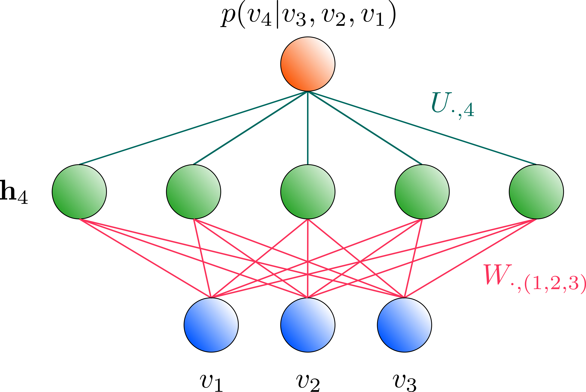

# Neural Autoregressive Distribution Estimators (NADEs)

## Introduction

Modeling states (ground or thermal) in computational physics requires calculating the partition function - an expression that scales exponentially with the number of constituents and is thus generally intractable. As a workaround, physicists commonly use probabilistic sampling methods, many of which are based on a Markov Chain (MC). A huge drawback about MC-based sampling is that the equilibration time required to generate uncorrelated samples can be very long. 

Restricted Boltzmann Machines (RBMs) are a class of generative models that have many appealing properties as a tool for statistical physics, yet it too is burdened by a MC-like procedure called Gibbs sampling.

In this post, we discuss an alternative that can be used for the purpose of state modeling: Neural Autoregressive Distributions Estimators (NADEs). The NADE is a generative model which is inspired by the RBM architecture, but unlike the RBM, it does not employ a MC-based sampling method. Algorithms wherein the partition function need not be calculated, yet the probability distribution defined by the model can be directly sampled, are called autoregressive.

## An RBM as a Bayesian Network

The probability of a sample's occurence, as modelled by an RBM, requires the calculation of the partition function, which is intractable. Recall that for an RBM,

$$
Z = \sum_{\mathbf{h} \in \mathcal{H}_{\mathbf{h}}} \sum_{\mathbf{v} \in \mathcal{H}_{\mathbf{v}}} e^{-E(\mathbf{v},\mathbf{h})},
$$

and

$$
p(\mathbf{v}) = \frac{e^{-\sum_{\mathbf{h} \in \mathcal{H}_{\mathbf{h}}}E(\mathbf{v},h)}}{Z},
$$

where $\mathbf{v}$ and $\mathbf{h}$ denote the visible and hidden layer of the RBM, respectively. Autoregressive models define a probability distribution that is the product of conditional disitributions of the $i^{\text{th}}$ visible unit ($v_i$) given all preceeding visible units ($\mathbf{v}_{<i}$):

$$
p_{\text{autoreg.}}(\mathbf{v}) = \prod_{i} p(v_i \vert \mathbf{v}_{<i}).
$$

If we can write the probability distribution defined by the RBM as a product of tractable conditionals like that of autoregressive models, then we can bypass calculating $Z$ entirely and directly sample the distribution. We can write $p(\mathbf{v})$ exactly as a product of conditionals by employing Baye's rule:

$$
p(\mathbf{v}) = \prod_{i} p(v_i \vert \mathbf{v}_{<i}) = \prod_{i} \frac{p(v_i, \mathbf{v}_{ \lt i})}{p(\mathbf{v}_{ \lt i})}.
$$

However, $p(v_i, \mathbf{v}_{ \lt i})$ nor $p(\mathbf{v}_{ \lt i})$ are tractable. If we can approximate both quantities, then there might be instances where the above expression is tractable and we've made the RBM autoregressive.

Consider a mean-field approach for the approximation (recall that a mean-field approximation just relates to the idea that our variables are independent, e.g. $p(a,b) = p(a)p(b)$): approximate $p(v_i \vert \mathbf{v}_{<i})$ by finding a tractable approximation for $p(v_i, \mathbf{v}_{>i}, \mathbf{h} \vert \mathbf{v}_{<i}) \approx q(v_i, \mathbf{v}_{>i}, \mathbf{h} \vert \mathbf{v}_{<i})$ such that $q(v_i \vert \mathbf{v}_{<i})$ is easily obtainable. In our mean-field approximation for $p(v_i, \mathbf{v}_{>i}, \mathbf{h} \vert \mathbf{v}_{<i})$, 

$$
\begin{aligned}
    q(v_i, \mathbf{v}_{>i}, \mathbf{h} \vert \mathbf{v}_{<i}) =& q(v_i \vert \mathbf{v}_{ \lt i}) q(\mathbf{v}_{>i} \vert \mathbf{v}_{<i}) q(\mathbf{h} \vert \mathbf{v}_{>i}) \\
    =& q(v_i \vert \mathbf{v}_{<i}) \prod_{j > i} q(v_j \vert \mathbf{v}_{<i}) \prod_k q(h_k \vert \mathbf{v}_{ \lt i}).
\end{aligned}
$$

Noting that $v_i \in 0,1$ (we will strictly deal with binary variables in this post), write the conditional distribution $q(v_j \vert \mathbf{v}_{<i})$ as binomial with a success ($v_i = 1$) probability $\mu_j (i)$:

$$
\begin{aligned}
    q(v_j \vert \mathbf{v}_{<i}) =& \mu_j(i)^{v_j} (1-\mu_j(i))^{1-v_j}.
\end{aligned}
$$

We may assume a similar form for $q(h_k \vert \mathbf{v}_{<i})$ (again, we also only consider binary hidden units):

$$
\begin{aligned}
    q(h_k \vert \mathbf{v}_{<i}) =& \tau_k(i)^{h_k} (1-\tau_k(i))^{1-h_k}.
\end{aligned}
$$

Therefore, 

$$
\begin{aligned}
    q(v_i, \mathbf{v}_{>i}, \mathbf{h} \vert \mathbf{v}_{<i}) =& \mu_i(i)^{v_i} (1-\mu_i(i))^{1-v_i} \prod_{j > i} \mu_j(i)^{v_j} (1-\mu_j(i))^{1-v_j} \prod_k \tau_k(i)^{h_k} (1-\tau_k(i))^{1-h_k},
\end{aligned}
$$

with

$$
\begin{aligned}
    \mu_j(i) =  & q(v_i = 1 \vert \mathbf{v}_{<i}) \approx p(v_i = 1 \vert \mathbf{v}_{\lt i}), \\
    \tau_k(i) = & q(h_k = 1 \vert \mathbf{v}_{\lt i}) \approx p(h_k = 1 \vert \mathbf{v}_{\lt i}).
\end{aligned}
$$

But what are $\mu_j(i)$ and $\tau_k(i)$? We need to find $\mu_j(i)$ for $j \geq i$ and $\tau_k(i)$ which minimize the KL divergence between $q(v_i, \mathbf{v}_{>i}, \mathbf{h} \vert \mathbf{v}_{<i})$ and $p(v_i, \mathbf{v}_{>i}, \mathbf{h} \vert \mathbf{v}_{<i})$. There exists an algebraic solution for this problem:

$$
\begin{aligned}
    \tau_k(i) = & \mathrm{sigm}\left(c_k + \sum_{j \geq i} W_{jk}\mu_j(i) + \sum_{j<i}W_{kj}v_j\right) \\
    \mu_j(i) =  & \mathrm{sigm}\left(b_j + \sum_{k}W_{kj}\tau_k(i)\right) \forall j \geq i.
\end{aligned}
$$

Note that these expressions depend on their counterparts (i.e. $\tau_k(i)$ depends on $\mu_j(i)$ and vice versa), and there is no exact solution for this set of non-linear equations. Similar to a Gibbs sampling procedure in an RBM where we bounce back and forth between the hidden and visible layers to infer the other conditioned upon the current, we can bounce back and forth between $\mu_j(i)$ and $\tau_k(i)$ (initialize them to 0), and we are guaranteed to converge to some equilibrium values of $\mu_j(i)$ and $\tau_k(i)$. Then, $\mu_j(i)$ is used to approximate $p(v_j = 1 \vert \mathbf{v}_{<i})$ and we have an autoregressive model!

Unfortunately, in making the RBM (approximately) autoregressive we also encounter computational bottlenecks. To determine $\mu_j(i)$ and $\tau_k(i)$ takes $O(10)$ iterations, and it turns out that each iteration is quite costly. Moreover, we would need to do this for every $v_i$. So, this mean-field approximation to make an RBM autoregressive does not actually end up being tractable.

## NADEs: Building off of the mean-field Bayesian RBM

Let's build off of this mean-field idea presented in the previous section. However, it's at this point where the physical ties to an RBM vanish. How the NADE architecture is formed is simply "inspired by" this mean-field approximation for an RBM. 

For one iteration with $\mu_j(i)$ initialized to zero,

$$
\begin{aligned}
    \mu_j(i)^{(0)} = 0 \rightarrow \tau_k(i)^{(0)} = \mathrm{sigm}\left(c_k + \sum_{j<i}W_{kj}v_j\right) \rightarrow \mu_j(i)^{(1)} = \mathrm{sigm}\left(b_j + \sum_{k}W_{kj}\tau_k(i)^{(0)}\right)
\end{aligned}
$$

If you stare at this long enough, you'll realize that this is simply many feed-forward networks, each with one hidden layer and shared weights going across the networks! There are $N$ networks to train, where $N$ is the number of visible units, and the input to the $i^{th}$ network is the $j<i$ preceeding parts of the visible layer (i.e. all visible unit values before the $i^{th}$ visible unit) as dictated by $\sum_{j<i}$. The activation of the hidden layer is given by $\tau_k(i)^{(0)}$, and the ouput of the network is $\mu_j(i)^{(1)}$ which we take to be the desired conditional $p(v_i = 1 \vert \mathbf{v}_{<i})$. The model is inherently autoregressive!

It turns out to be computationally benefitial to train a seperate set of weights connecting the output of the networks with the hidden layers, rather than having a shared weight matrix. Each of the $N$ networks looks like the following:

$$
\begin{aligned}
    \mathrm{input} =      & \mathbf{v}_{\lt i}                                                                           \\
    \mathrm{activation} = & \mathbf{h}_i = \mathrm{sigm}(\mathbf{c} + \mathbf{W}_{\cdot, \lt i} \mathbf{v}_{\lt i})         \\
    \mathrm{output} =     & p(v_i = 1 \vert \mathbf{v}_{\lt i}) = \mathrm{sigm}(b_i + \mathbf{U}_{i,\cdot} \mathbf{h}_i)
\end{aligned}
$$

There is a lot of reusing parameters in each of the $N$ networks. Let's just jot some things down to understand the architecture better.

- For $N$ sites, there are $N$ hidden layers that each comprise of $n_h$ neurons.
- $\mathbf{W}$ ($n_h \times N$ matrix) and $\mathbf{c}$ are shared by all $N$ networks.
- $\mathbf{U}$ is $N \times n_h$.

Training the NADE boils down to minimizing the negative log-likelihood of the parameters given the training set.

$$
\begin{aligned}
    \mathrm{NLL} =& -\frac{1}{\vert D \vert} \sum_{\mathbf{v} \in D} \log p(\mathbf{v}) \\
    =& -\frac{1}{\vert D \vert} \sum_{\mathbf{v} \in D} \sum_{i = 1}^N \log p(v_i = 1 \vert \mathbf{v}_{<i}) 
\end{aligned}
$$

The autoregressive probability, $p(\mathbf{v})$, is calculated via the following procedure:

$$
\begin{aligned}
    &p(\mathbf{v}) = 1 \\
    &\mathbf{a} = \mathbf{c} \\
    &\text{for i in 1:N} \\
    &\qquad \mathbf{h}_i \leftarrow sigm(\mathbf{a}) \\
    &\qquad p(v_i = 1 \vert \mathbf{v}_{\lt i}) \leftarrow sigm(b_i + \mathbf{U}_{i,\cdot}\mathbf{h}_i) \\
    &\qquad p(\mathbf{v}) \leftarrow p(\mathbf{v}) \times p(v_i = 1 \vert \mathbf{v}_{\lt i})^{v_i} \times \left( 1 - p(v_i = 1 \vert \mathbf{v}_{\lt i}) \right)^{1-v_i} \\
    &\qquad \mathbf{a} \leftarrow \mathbf{a} + \mathbf{W}_{\cdot,i} v_i \\

    &\text{return} \qquad p(\mathbf{v})
\end{aligned}
$$

Now, we can calculate gradients of the NLL w.r.t. the NADE parameters ($\mathbf{W}, \mathbf{U}, \mathbf{b}, \mathbf{c}$). Note, $\bigodot$ refers to an element-wise multiplication.

$$
\begin{aligned}
&\delta \mathbf{a} = 0 \\
&\delta \mathbf{c} = 0 \\
&\text{for i in 1:N} \\
&\qquad \delta b_i \leftarrow p(v_i = 1 \vert \mathbf{v}_{<i}) - v_i \\
&\qquad \delta \mathbf{U}_{i, \cdot} \leftarrow \left( p(v_i = 1 \vert \mathbf{v}_{<i}) - v_i \right) \mathbf{h}_{i} \\
&\qquad \delta \mathbf{h}_i \leftarrow \left( p(v_i = 1 \vert \mathbf{v}_{<i}) - v_i \right) \mathbf{U}_{i, \cdot} \\
&\qquad \delta \mathbf{c} \leftarrow \delta \mathbf{c} + \delta \mathbf{h}_i \bigodot \mathbf{h}_i \bigodot (1 - \mathbf{h}_i) \\
&\qquad \delta \mathbf{W}_{\cdot,i} \leftarrow \delta \mathbf{a} v_i \\
&\qquad \delta \mathbf{a} \leftarrow \delta \mathbf{a} + \delta \mathbf{h}_i \bigodot \mathbf{h}_i \bigodot (1 - \mathbf{h}_i) \\
&\text{return} \qquad \delta \mathbf{b}, \delta \mathbf{c}, \delta \mathbf{W}, \delta \mathbf{U}
\end{aligned}
$$

## Try for yourself!

I have open-source code for using NADEs to do quantum state reconstruction. It is relatively new and continues to be regularily updated with more functionality. Go check it out [here](https://github.com/isaacdevlugt/GreNADE.git).

## References 

[1] B. McNaughton, M. V. Milošević, A. Perali, and S. Pilati, ArXiv:2002.04292 (2020).

[2] H. Larochelle and I. Murray, AISTATS 15, 9 (2011).

[3] B. Uria, M.-A. Côté, K. Gregor, I. Murray, and H. Larochelle, ArXiv:1605.02226 (2016).
